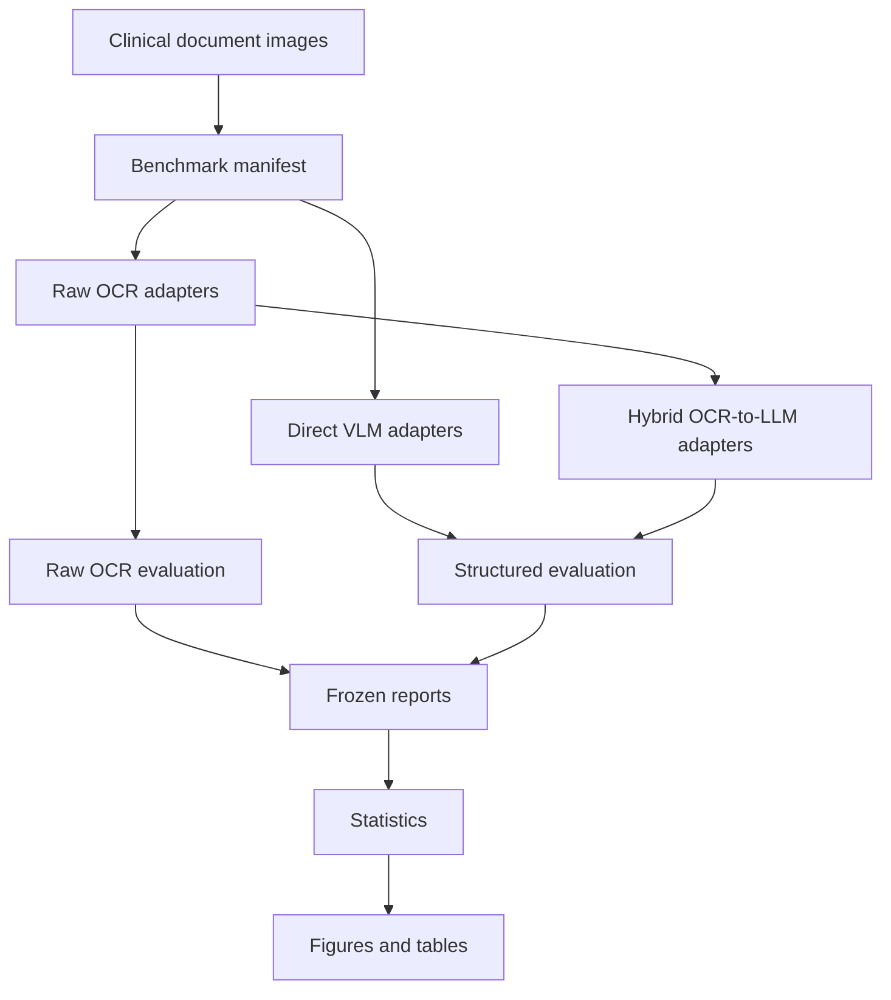

# Architecture

ClinDoc-Bench-IN separates data preparation, model inference, evaluation, statistics, and publication assets.

The frozen benchmark lives under `benchmark/final/` and is read-only. New experiments should write elsewhere and then be compared against the frozen reports.

## System Flow

## Key Principles

- The manifest is the contract between data, predictions, and evaluation.
- Each lane is evaluated independently before aggregation.
- Canonical JSON is validated before structured scoring.
- Provenance records preserve artifact location, timestamp, coverage, and publication status.
- Publication assets are regenerated from frozen CSVs, not from live model calls.
